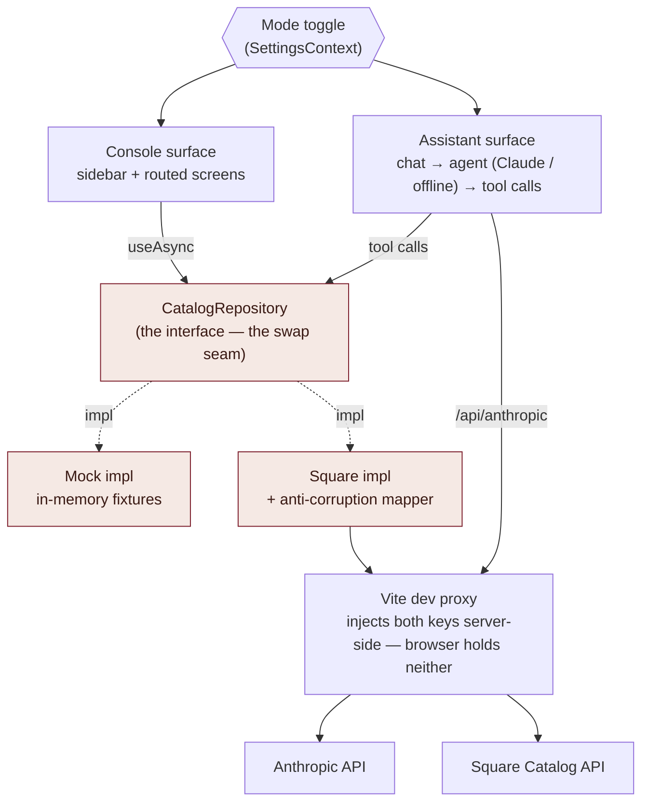
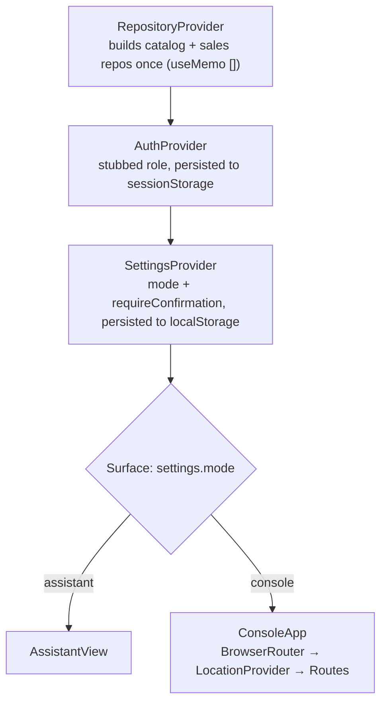
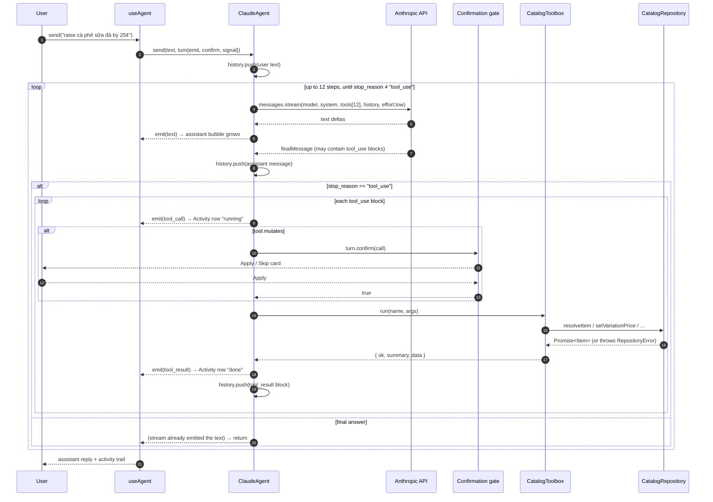
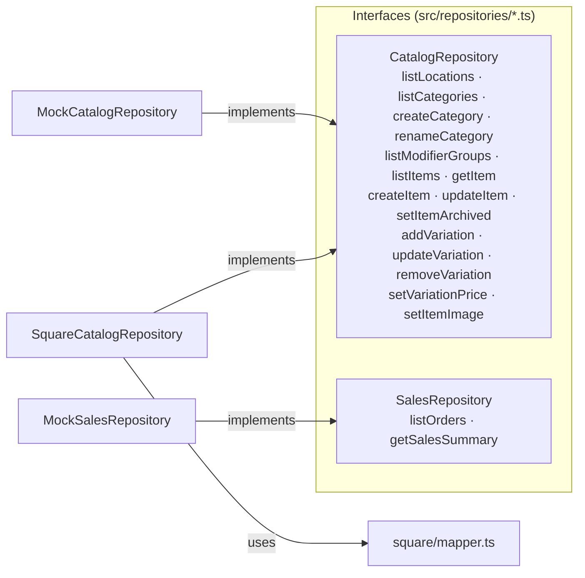
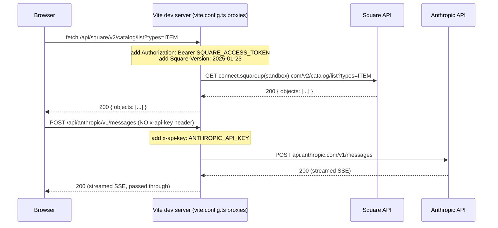
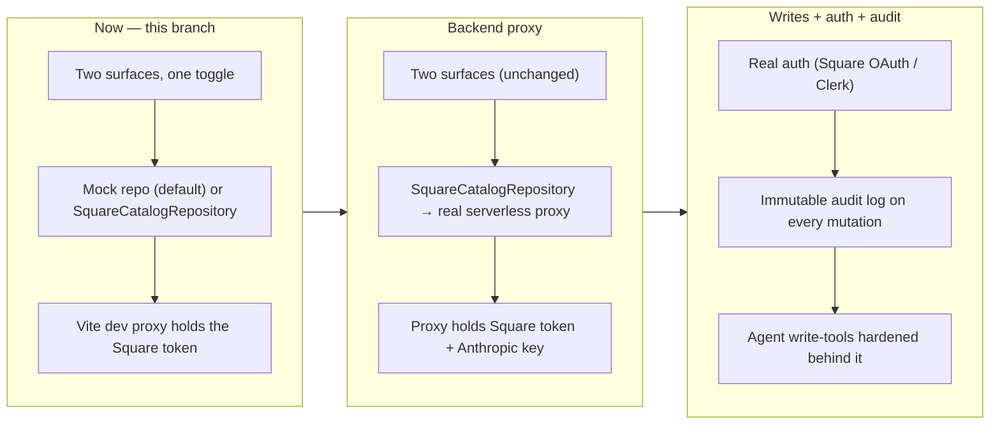

# Architecture

_Cà phê Việt menu admin — the whole app, as built. Companion docs: `DOMAIN.md`
(catalog model), `PLAN.md` (phasing & decisions), `README.md` (setup)._

---

## 1. What this is

A **client-only React SPA** (Vite) for managing the menu of a US-based,
Vietnamese-branded coffee business whose catalog of record is **Square**. It
presents **two interchangeable surfaces behind one toggle**:

| Surface | What it is | Shell |
|---|---|---|
| **Assistant** (default) | Agent-first chat. You describe menu changes in plain language; an LLM (Claude with tool-use, or an offline command parser when no key is set) executes them through tools. Every mutation is gated by a human **Apply / Skip** card. | `features/assistant/AssistantView` — mobile, single-column |
| **Console** | Conventional admin console: React-Router screens for Items, Categories, Modifier groups, Pricing, and navigable Reporting / Analytics / Order-history scaffolds. Sidebar nav, role-gated edit actions. | `layout/AppShell` — sidebar + content |

The two surfaces are **peers**, not layers. They share one contract — the
`CatalogRepository` interface — and nothing else. A change made in one is visible
in the other (see §7, cross-surface reactivity).

**Design principle:** every screen and every agent tool talks to the repository
interface, never to data directly. The implementation behind that interface
(in-memory mock, live Square, or a future backend proxy) swaps with **zero
component changes**.

---

## 2. Technology

| Concern | Choice |
|---|---|
| Build / dev server | Vite 8, `@vitejs/plugin-react` |
| UI | React 19, TypeScript 6 (strict, `erasableSyntaxOnly`, `verbatimModuleSyntax`) |
| Routing (Console only) | React Router 7 (`BrowserRouter`) |
| Styling | Tailwind CSS v4 (`@tailwindcss/vite`) + hand-authored CSS in `index.css` for the chat surface; design tokens as CSS custom properties |
| LLM | `@anthropic-ai/sdk` (browser build, streaming, tool use) |
| Lint | oxlint |
| State | React context + hooks; `useSyncExternalStore` for the cross-surface revision counter. No Redux/Zustand/query library. |
| Tests | none yet (repository/toolbox layer is thin and verified by eye) |

Runtime dependencies are deliberately few: `react`, `react-dom`,
`react-router-dom`, `@anthropic-ai/sdk`.

---

## 3. System overview



Both surfaces are peers that share nothing but this repository interface (shaded
pink). §5–§9 unpack each box; the fuller, all-components version of this diagram
is in the session history if you want it back.

---

## 4. Runtime composition

`main.tsx` mounts `<App/>` in `React.StrictMode`. `App.tsx` is only a provider
tree plus a surface switch:



| Provider | Holds | Persistence | Notes |
|---|---|---|---|
| `RepositoryProvider` | `{ catalog, sales, source }` | — | Chooses `Mock` vs `Square` from `VITE_DATA_SOURCE` at construction. Instances are stable for the session. |
| `AuthProvider` | `{ user, role, setRole, can }` | `sessionStorage["cvp.devRole"]` | Stubbed. `can(capability)` is the single gate used by both surfaces. |
| `SettingsProvider` | `{ mode, setMode, requireConfirmation, setRequireConfirmation }` | `localStorage["cpv.settings"]` | `mode` drives the top-level surface switch. |
| `LocationProvider` | `{ currentLocation, allLocations }` | — | Console-only (inside `ConsoleApp`). Loads locations via the repository, picks the first active. No switcher UI yet. |

---

## 5. The Assistant surface

### 5.1 Components

```
AssistantView                     mobile shell — brand, DataSourceBadge, ⚙ SettingsPanel, ModeToggle
└─ ChatView                        transcript + composer
   ├─ intro / suggestion chips     shown when the transcript is empty
   ├─ msg bubbles                  user / assistant text
   ├─ Activity rows                one per tool call: running → done / error / declined
   ├─ ConfirmCard                  Apply / Skip for a pending mutating tool call
   └─ composer                     auto-growing textarea; Enter to send, ■ to stop
```

`SettingsPanel` (in the ⚙ menu) exposes: **View as** (admin/staff), **Confirm
every change** (the `requireConfirmation` toggle), and read-outs of the catalog
source and agent kind.

### 5.2 `useAgent()` — the bridge

Constructs the agent once (`ClaudeAgent` if `hasAnthropicKey`, else
`OfflineAgent`), keyed on the catalog repo. Owns:

- `entries` — the chat transcript (`user` | `assistant` | `activity` | `notice`)
- `busy`, `pending` (the active confirmation), an `AbortController` per turn
- `send(text)` — runs a turn, translating streamed `AgentEvent`s into transcript
  mutations
- the **confirmation gate** passed to the agent as `turn.confirm(call)`:
  - `!can("catalog.write")` → auto-deny
  - `!requireConfirmation` → auto-approve
  - else → set `pending`, return a promise the `ConfirmCard` buttons resolve
- on a successful mutating tool result → `bumpCatalogRevision()` (see §7)

### 5.3 The agent loop (`ClaudeAgent`)



- **System prompt** fixes the role: menu assistant for Cà phê Việt, Square is the
  record, use tools for every read/write, keep replies mobile-short, don't ask
  "are you sure" (the app shows the card).
- **History** is in-memory on the `ClaudeAgent` instance. `reset()` (or a repo
  change) clears it. Not persisted.
- **Guard:** 12 tool-use rounds max, then a "stopped after too many steps"
  notice.
- **Abort:** the composer's ■ button aborts the `AbortController`; the SDK stream
  and the loop both honour `turn.signal`.

### 5.4 `OfflineAgent` (no API key)

Not conversational. Matches the message against ~9 regexes → one tool call →
the **same** `CatalogToolbox` and confirmation gate → emits "Done." or the error.
Single-shot, no history. `"help"` lists what it understands.

### 5.5 Tool surface (`catalogTools.ts`)

12 tools, each mapping to one or a few `CatalogRepository` calls:

| Tool | Mutates | Repository call(s) |
|---|---|---|
| `list_menu` | — | `listItems` (+ `listCategories` to resolve a category filter) |
| `list_categories` | — | `listCategories` |
| `find_item` | — | `listItems({includeArchived:true})` + substring filter |
| `create_item` | ✔ | `resolveCategoryId` → `createItem` |
| `rename_item` | ✔ | `resolveItem` → `updateItem` |
| `set_item_description` | ✔ | `resolveItem` → `updateItem` |
| `set_item_category` | ✔ | `resolveItem` + `resolveCategoryId` → `updateItem` |
| `set_price` | ✔ | `resolveItem` + `pickVariation` → `setVariationPrice` |
| `add_variation` | ✔ | `resolveItem` → `addVariation` |
| `archive_item` / `unarchive_item` | ✔ | `resolveItem` → `setItemArchived` |
| `create_category` | ✔ | `createCategory` |

`CatalogToolbox` also does the fuzzy resolution the model relies on:
`resolveItem` (by id, then exact name, then unique substring — throws with the
candidate list if ambiguous), `resolveCategoryId`, `pickVariation`, and
`money()` (parse `4.5` → `{amount:450,currency:"USD"}`). Every dispatch is
wrapped so a `RepositoryError` becomes `{ ok:false, summary }` for the model to
read and explain.

---

## 6. The Console surface

### 6.1 Routes

| Path | Component | Purpose | Gate |
|---|---|---|---|
| `/` | → redirect `/items` | | |
| `/items` | `ItemsListPage` | Search, show-archived toggle, table (name/category/variations/price range/status) | "New item" needs `catalog.write` |
| `/items/new` | `ItemCreatePage` | Name, description, category, ≥1 variation (name + price), modifier groups | redirects out without `catalog.write` |
| `/items/:itemId` | `ItemDetailPage` | Details section, Variations (add/remove), Modifier-group attach/detach, archive/unarchive | edit controls hidden without `catalog.write`; read-only notice shown |
| `/categories` | `CategoriesPage` | List, create, rename inline | create/rename need `catalog.write` |
| `/modifier-groups` | `ModifierGroupsPage` | Read-only table (name, selection rule, options with price deltas) | — |
| `/pricing` | `PricingPage` | One row per variation; inline price edit | redirects out without `pricing.read`; edit needs `pricing.write` |
| `/reporting`, `/analytics`, `/orders` | `ReportingPage` / `AnalyticsPage` / `OrderHistoryPage` → `ScaffoldPage` | Navigable, honest "no data yet" empty states | — |
| `*` | `NotFoundPage` | | |

`AppShell` filters the sidebar to nav items whose `requires` capability the
current role has (so staff never sees Pricing), renders the role switcher and the
data-source badge, and hosts the `<ModeToggle/>` passed in from `App.tsx`.

### 6.2 Data loading

Screens call `useAsync(() => catalog.listItems(), [deps])` — a ~40-line hook:
`{ data, loading, error, reload }`, cancels on unmount, re-runs on dep change or
`reload()`. No cache. After a mutation, screens call `reload()`. Screens also
subscribe to `useCatalogRevision()` so an edit from the *other* surface triggers
a refetch (§7).

---

## 7. Shared core

### 7.1 Domain model (`src/domain/`)

A faithful, ergonomic projection of Square's Catalog — **never richer than
Square** (no combos/bundles, no channel/time pricing, no nested modifiers). Full
detail in `DOMAIN.md`. Shapes:

- `Money { amount: integer minor units, currency }` — never a float
- `Item { id, name, description?, categoryId?, variations[], modifierGroupIds[], archived, imageUrl? }`
  — `imageUrl` is read-through from Square's attached `CatalogImage`; setting a
  new one only works against the mock repo (Square needs a real file upload,
  not a URL) — see `setItemImage` in §7.2
- `Variation { id, itemId, name, price: Money, sku?, priceOverrides[] }` — the
  priced sellable unit; "size" lives here
- `ModifierGroup { id, name, required, minSelect, maxSelect, options[] }` —
  business-level, reusable; `ModifierOption { …, priceDelta: Money }`
- `Category { id, name }`, `Location { id, name, status }`
- `Role = "admin" | "staff"`

Helpers: `formatMoney`, `parseMoney`, `effectivePrice(variation, locationId)`.

### 7.2 Repository layer (`src/repositories/`)



All 15 `CatalogRepository` methods are async, return plain domain objects, and
reject with a typed `RepositoryError` on failure.

Every method is **async and remote-call-shaped**: returns plain domain objects,
rejects with a typed `RepositoryError` (`NotFoundError`, `ValidationError`,
`PermissionError`) on failure. Both surfaces handle failure identically.

| Implementation | Reads | Writes | Notes |
|---|---|---|---|
| `MockCatalogRepository` | from in-memory arrays seeded from `fixtures` (cloned via `structuredClone` so callers can't mutate the store) | mutate the arrays in place | 180 ms simulated latency; `NotFoundError`/`ValidationError` on bad input; **session-only** — refresh reverts. `import.meta.glob` picks up `fixtures.generated.json` if the Square export was run. |
| `SquareCatalogRepository` | `GET /api/square/v2/catalog/list?types=…` (paginated), filters `is_deleted` | **retrieve → mutate tree → upsert whole ITEM** (Square's optimistic-concurrency model: needs the object's `version`); `POST /catalog/object` with an `idempotency_key` | maps Square 400 → `ValidationError`, 404 → `NotFoundError`; wraps network failure with a "is the dev server running with the token?" hint |
| `MockSalesRepository` | resolves empty | — | Reporting/orders scaffolds render against this. **No order or customer data is ever pulled** (live revenue + PII). |

`RepositoryProvider` selects `catalog` from `VITE_DATA_SOURCE` (`"square"` →
`SquareCatalogRepository`, anything else → `MockCatalogRepository`). Moving to a
production backend = change those constructors; nothing else moves.

### 7.3 Anti-corruption layer (`square/mapper.ts`)

Quarantines every Square-ism: the `type` discriminator, nested `*_data`
payloads, `version` numbers, temp `#name` ids, `{amount,currency}` money,
`categories[]` vs legacy `category_id`, `modifier_list_info[].enabled`,
`selection_type` → `minSelect`/`maxSelect`. Exposes `itemFromSquare`,
`variationFromSquare`, `categoryFromSquare`, `modifierGroupFromSquare` (Square →
domain) and `variationToSquare`, `toSquareMoney` (domain → Square upsert
payloads). Components and the agent never import this file.

### 7.4 Cross-surface reactivity (`catalogRevision.ts`)

A module-level integer + listener set, read through `useSyncExternalStore`.
`bumpCatalogRevision()` is called after any successful mutation (by `useAgent`
after a tool result, and by console screens after their own writes). Console
screens include `useCatalogRevision()` in their `useAsync` deps, so a price
changed in chat shows up in the Console list without a manual refresh — and vice
versa. This is the only shared *state* between the two surfaces; everything else
flows through the repository.

---

## 8. Configuration & secrets

`config/env.ts` is the only place browser-visible config is read. **Both
secrets — the Square token and the Anthropic key — are read exclusively by
`vite.config.ts` (Node, server-side) and are absent from `src/vite-env.d.ts`,
so referencing either from client code is a type error, not just a
convention.** Neither is ever bundled.

| Variable | Read by | In browser bundle? | Purpose |
|---|---|---|---|
| `VITE_DATA_SOURCE` | `config/env.ts` | yes | `mock` (default) or `square` |
| `VITE_AGENT_MODEL` | `config/env.ts` | yes | agent model id — not a secret |
| `SQUARE_ACCESS_TOKEN` | **`vite.config.ts` only** (`loadEnv`) | **no** | injected into `/api/square/*` by the dev proxy |
| `SQUARE_ENVIRONMENT` | `vite.config.ts`, `scripts/` | no | `sandbox` \| `production` → Square host |
| `SQUARE_LOCATION_ID` | `scripts/` (optional) | no | pin one location |
| `ANTHROPIC_API_KEY` | **`vite.config.ts` only** (`loadEnv`) | **no** | injected into `/api/anthropic/*` by the dev proxy |

The client learns *whether* the agent is usable — never the key — via
`GET /api/anthropic-status → { configured: boolean }`, a tiny middleware
registered in `vite.config.ts`. `useAnthropicAvailability()`
(`config/agentAvailability.ts`) fetches it once (module-level cache shared by
`useAgent` and the settings panel) and resolves `"checking" → "available" |
"unavailable"`.

### How both keys stay server-side

Same pattern for both external calls: the browser never sends an auth header
itself, the dev-server proxy adds it.



For Anthropic, `ClaudeAgent` constructs the SDK with
`baseURL: "/api/anthropic"` and `defaultHeaders: { "X-Api-Key": null }` — the
`null` tells the SDK the header is *intentionally* omitted (a documented SDK
mechanism), so it sends the request with no key rather than throwing "missing
API key". Streaming passes through the proxy untouched.

**Production migration:** replace both Vite dev proxies with a real backend
(serverless function or otherwise) doing the same header injection — plus, by
then, real auth and an audit log. `SquareCatalogRepository` and `ClaudeAgent`
keep calling `/api/square/*` and `/api/anthropic/*` — no app-code change.

---

## 9. Auth & permissions

Stubbed, no real identity. `AuthProvider` holds a `Role` (`admin` | `staff`),
flipped by the "View as" control in both shells, persisted to `sessionStorage`.

| Capability | admin | staff |
|---|---|---|
| `catalog.write` | ✔ | — |
| `pricing.read` | ✔ | — |
| `pricing.write` | ✔ | — |

`can(capability)` is the single enforcement point:

- **Console:** hides nav items (`AppShell` filters by `requires`), hides/disables
  edit controls, redirects unauthorised routes (`/pricing`, `/items/new`).
- **Assistant:** `useAgent`'s confirmation gate auto-denies every mutating tool
  when `!can("catalog.write")`, and the intro tells staff changes are disabled.

Real auth (Square OAuth or Clerk) replaces the provider internals in a later
phase; `can()` and every call site stay.

---

## 10. Current limitations / not yet built

| Area | State |
|---|---|
| **Persistence of mock writes** | none — refresh reverts to fixtures (intentional for now) |
| **Reporting / analytics / orders** | navigable scaffolds only; no data pulled |
| **Refunds, inventory, staff/shifts, customers/loyalty** | out of scope |
| **Modifier group editing** | read-only in the Console; the agent can attach/detach groups but not define new ones |
| **Location switcher & per-location price overrides** | model supports `locationId` + `priceOverrides`; no UI |
| **Item image uploads against Square** | reading an existing Square image works; setting a new one only works against the mock repo (URL field) — Square requires a real file upload via its Images API, not implemented |
| **Audit log** | none — no "who changed what" trail on writes |
| **Auth** | stubbed; no real identity or security |
| **Tests** | none |
| **Square writes** | implemented against the dev proxy; not exercised against a real backend or with real concurrency |
| **Theme** | light only (keeps the two surfaces visually coherent) |

---

## 11. Phase evolution



The original `PLAN.md` sequenced the agent as P4 (after a conventional-first
build). This branch built it early, against the mock/Square repository; it
hardens as the backend lands. Only the repository implementation and its backing
service change across phases — the domain model, both surfaces, the agent tools,
and the `CatalogRepository` interface stay stable.

---

## 12. Directory map

```
index.html                       Google Fonts (Lora, Be Vietnam Pro), theme-color, root
vite.config.ts                   React + Tailwind plugins; /api/square dev proxy (token injection)
.env.example                     documented env template → copy to .env.local

src/
  main.tsx                       React root (StrictMode)
  App.tsx                        provider tree + Assistant/Console surface switch
  index.css                      design tokens (Phin POS palette) + assistant-surface CSS + shared button vocabulary
  vite-env.d.ts                  typed import.meta.env

  config/
    env.ts                       browser-visible config (dataSource, agentModel, proxy base paths) — NO secrets
    agentAvailability.ts         asks /api/anthropic-status; never sees the key itself

  domain/                        internal catalog model (faithful Square projection — see DOMAIN.md)
    money.ts  catalog.ts  location.ts  auth.ts  index.ts

  repositories/
    CatalogRepository.ts         the interface both surfaces depend on
    SalesRepository.ts           reporting/orders interface (mock-only for now)
    errors.ts                    RepositoryError · NotFoundError · ValidationError · PermissionError
    RepositoryContext.tsx        picks Mock vs Square from VITE_DATA_SOURCE
    catalogRevision.ts           cross-surface "catalog changed" counter
    mock/
      fixtures.ts                hand-authored Vietnamese menu; loads fixtures.generated.json if present
      MockCatalogRepository.ts   in-memory, cloned reads, session-only writes, simulated latency
      MockSalesRepository.ts     resolves empty
    square/
      SquareCatalogRepository.ts fetch → /api/square; retrieve-mutate-upsert writes
      mapper.ts                  anti-corruption layer (Square CatalogObject ⇄ domain)

  agent/
    catalogTools.ts              12 tool specs + CatalogToolbox dispatch (1 tool = 1..n repo calls)
    ClaudeAgent.ts               Anthropic streaming tool-use loop; pauses on mutating tools
    OfflineAgent.ts              no-key fallback: regex intents → same toolbox
    useAgent.ts                  hook: transcript state + confirmation gate + revision bump
    types.ts                     Agent · AgentTurn · AgentEvent · ToolCall

  features/
    assistant/AssistantView.tsx  mobile chat shell (header, data badge, settings panel, mode toggle)
    chat/ChatView.tsx            transcript, activity rows, ConfirmCard, composer

  auth/AuthContext.tsx           stubbed admin/staff role + can(capability)
  settings/SettingsContext.tsx   mode + requireConfirmation, persisted to localStorage
  location/LocationContext.tsx   current location (console-only)
  i18n/copy.ts                   t() seam — English only
  lib/useAsync.ts                minimal async-data hook (no cache)
  lib/placeholderImage.ts        deterministic initials-badge SVG data URI for items with no image

  components/
    ModeToggle.tsx               Assistant ⟷ Console switch (both shells)
    ui.tsx                       Console primitives (Button, Card, Field, TextInput, Badge, Spinner, EmptyState, ErrorState…)
    ItemThumbnail.tsx            renders item.imageUrl, or the generated placeholder
    PhinMark.tsx                 brand mark SVG

  layout/AppShell.tsx            Console shell — sidebar nav (capability-filtered), role switcher, data badge
  routes/
    catalog/                     ItemsListPage · ItemDetailPage · ItemCreatePage · CategoriesPage · ModifierGroupsPage · priceRange.ts
    pricing/PricingPage.tsx      per-variation price editing (admin only)
    reports/                     ReportingPage · AnalyticsPage · OrderHistoryPage → ScaffoldPage
    NotFoundPage.tsx

scripts/
  export-square-catalog.mjs      one-time local pull of real catalog + locations → fixtures.generated.json
```
