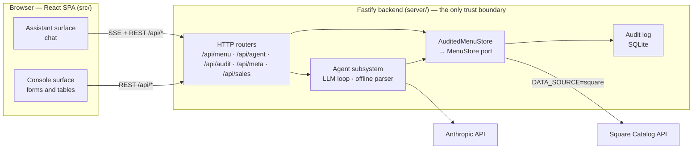
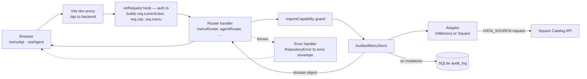
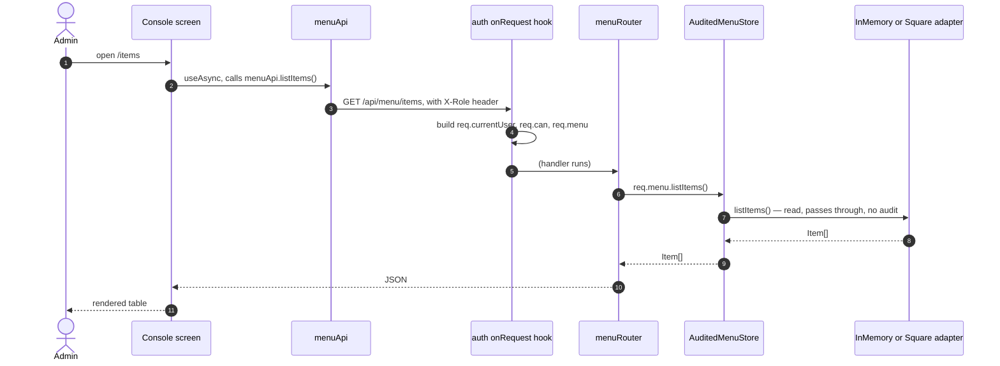
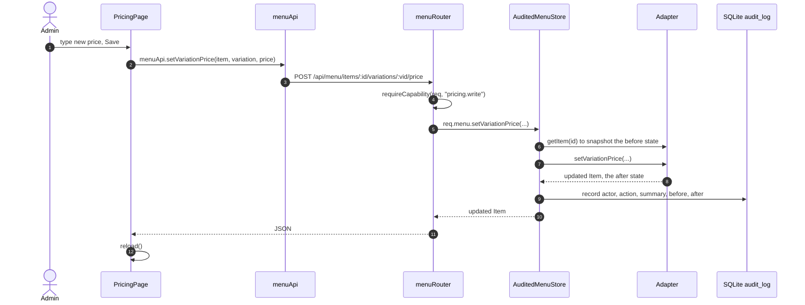
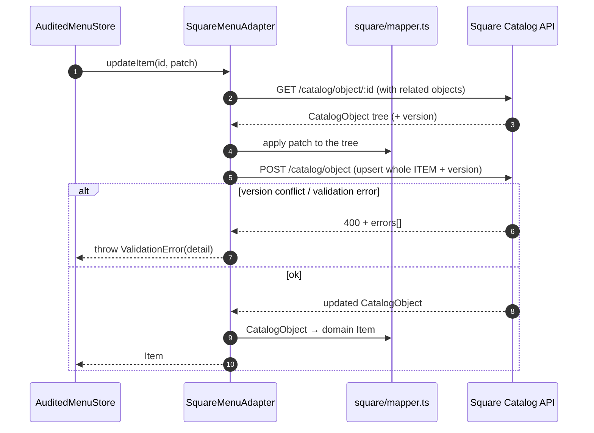
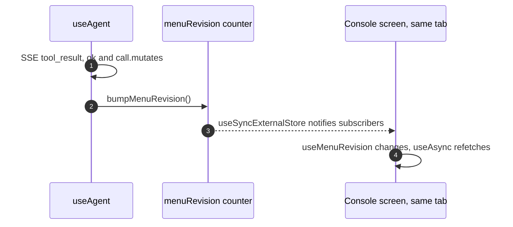
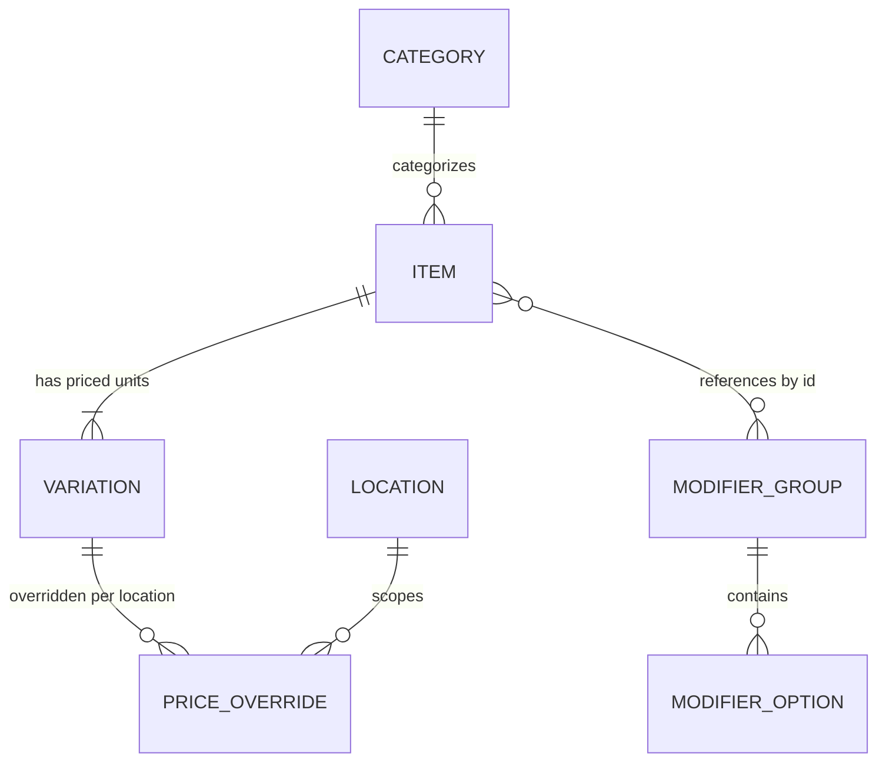
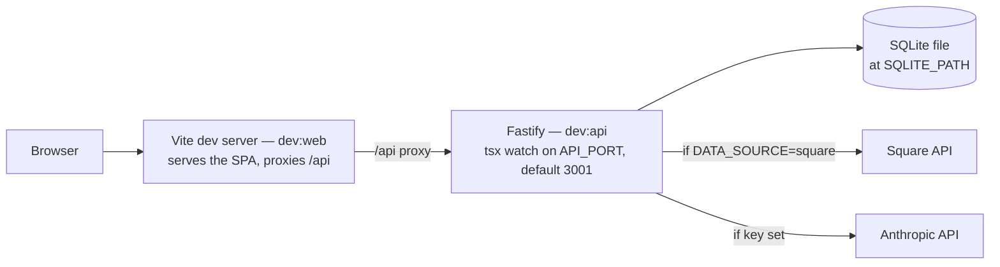

# Architecture

_How the Cà phê Việt menu admin is built, as it exists in the code. Companion
docs: `DOMAIN.md` (the catalog model in detail), `PLAN.md` (phasing &
historical decisions), `README.md` (setup)._

---

## 1. System Overview

**What it does.** A back-office admin app for a US-based, Vietnamese-branded
coffee business. It manages the **menu** — items, sizes/prices, categories,
modifier groups — and records every change. It is *not* a register or a
customer-facing site.

**Square is the catalog of record.** This app is a workflow and interface layer
on top of Square; it never becomes a second source of truth for the menu.

**Two surfaces, one backend.** The same menu operations are exposed two ways:

- an **Assistant** (default): an AI chat where you describe changes in plain
  language and approve each one;
- a **Console**: a conventional admin UI with forms and tables.

**Primary users.**

| User | Access |
|---|---|
| Owner / admin | Everything: view, create, edit, re-price, archive |
| Staff | View-only — no pricing screen, no mutations |

Identity is **stubbed** (an `X-Role` header, no login).

**External dependencies.** Both are optional and have local fallbacks:

| Service | Used for | Fallback |
|---|---|---|
| **Square Catalog API** | The live menu, when `DATA_SOURCE=square` | In-memory fixtures (`DATA_SOURCE=mock`, the default) |
| **Anthropic API** | The chat agent's language model | A small server-side regex command parser |

---

## 2. Architecture at a Glance



The browser holds no secrets and calls no third party. Everything sensitive —
the Square token, the Anthropic key, validation, permission checks, the audit
log — lives behind `/api/*`.

---

## 3. Technology Stack

| Layer | Technology | Why it's here |
|---|---|---|
| Frontend SPA | React 19, TypeScript 6, Vite 8 | Single bundle serving both surfaces |
| Console routing | React Router 7 | Multi-screen admin UI (Console only) |
| Console styling | Tailwind v4 | Utility styling for the conventional UI |
| Assistant styling | Hand-written CSS (`src/index.css`) | The chat shell is a bespoke mobile layout |
| Backend | Fastify 5 on Node 24 | The trust boundary; owns integrations & secrets |
| LLM | `@anthropic-ai/sdk` — **server-side only** | Streaming tool-use loop for the Assistant |
| Data access | `MenuStore` port + adapters (hand-rolled, no ORM) | Swap in-memory ↔ Square by env flag |
| Persistence | `better-sqlite3` behind an `AuditLog` interface | Only the audit log is persisted |
| Shared contract | `shared/` (domain types, ports, wire contract, errors) | One source of truth imported by both ends via the `shared/*` path alias |
| Auth | Stub — `X-Role` header + `can(role, capability)` | Real identity is a follow-up; the seam exists |
| Lint | oxlint | — |
| Tests | **none** | No framework wired yet |
| Deploy | **not configured** | `build` / `build:api` produce artifacts; no host |

Runtime dependencies: `react`, `react-dom`, `react-router-dom` (client);
`fastify`, `better-sqlite3`, `@anthropic-ai/sdk` (server).

TypeScript is split into three projects (`tsconfig.app.json`,
`tsconfig.server.json`, `tsconfig.node.json`); `shared/*` resolves in both the
app and the server project.

---

## 4. Repository Structure

```text
shared/                  Contract imported by BOTH sides (path alias shared/*)
  domain/                Catalog model + stub auth model (see DOMAIN.md)
  MenuStore.ts           The data-access port (+ its input types)
  SalesStore.ts          Stub port for reporting screens
  errors.ts              RepositoryError family + wire <-> class mapping
  api.ts                 REST + agent-SSE wire contract

server/                  Fastify backend — run by `tsx watch` in dev
  index.ts               Bootstrap: body parser, auth hook, error handler, routers
  config.ts              Reads env once (DATA_SOURCE + the two secrets)
  auth.ts                onRequest hook -> req.currentUser / req.can() / req.menu
  menu/                  The MenuStore implementations
    factory.ts           Chooses in-memory vs Square from DATA_SOURCE
    AuditedMenuStore.ts  Per-request decorator: logs every mutation
    memory/              InMemoryMenuAdapter + InMemorySalesAdapter + fixtures
    square/              SquareMenuAdapter + mapper.ts (anti-corruption layer)
  agent/                 The Assistant's server-side brain
    menuTools.ts         12 tool specs + MenuToolbox (tool -> MenuStore calls)
    loop.ts              Claude tool-use loop (streams AgentEvents)
    offline.ts           Regex parser used when ANTHROPIC_API_KEY is unset
    run.ts               Shared per-tool path: announce -> permit -> confirm -> execute
    pending.ts           The Apply/Skip confirm round-trip (deferred map)
    conversations.ts     In-memory chat history, bounded
  audit/
    AuditLog.ts          Interface { record, list }
    SqliteAuditLog.ts    better-sqlite3 impl — one append-only table
  routes/                One Fastify router per area: menuRouter, agentRouter,
                         auditRouter, metaRouter, salesRouter

src/                     React SPA — talks only to /api/*
  App.tsx                Provider tree + Assistant/Console switch
  api/
    client.ts            fetch wrapper: attaches X-Role, rebuilds typed errors
    menu.ts              menuApi — one fetch fn per /api/menu/* endpoint
    menuRevision.ts      Cross-surface "the menu changed" counter
  agent/useAgent.ts      SSE client for the Assistant
  auth/ meta/ settings/ location/   React context providers
  features/assistant/ · features/chat/   The chat shell + transcript
  layout/AppShell.tsx    Console shell (sidebar, role switcher, data badge)
  routes/menu/ · routes/pricing/ · routes/reports/   Console screens
  i18n/copy.ts           t() — the single English dictionary for Console chrome

scripts/export-square-catalog.mjs   One-time local pull of a real menu -> fixtures
```

---

## 5. Component Responsibilities

### React SPA (`src/`)

- **Owns:** all UI and UI state; the surface toggle; the stub role switcher
  (`sessionStorage`); user settings (`localStorage`); folding the agent's SSE
  stream into a chat transcript.
- **Talks to:** only `/api/*` (via `src/api/client.ts`).
- **Not responsible for:** validation, permission decisions, or any knowledge
  of Square/Anthropic. It learns two facts from `GET /api/meta`
  (`{ dataSource, agentAvailable }`) and nothing else about configuration.

### Fastify backend (`server/`)

- **Owns:** the two secrets, the Square integration, the LLM loop, request
  validation, permission enforcement, and audit writes. It is the **only trust
  boundary**.
- **Talks to:** the browser (REST + SSE), Square, Anthropic, and the SQLite
  file.

### `MenuStore` port + adapters (`server/menu/`)

- **`MenuStore`** (`shared/MenuStore.ts`) — the port: 15 async methods
  (`listItems`, `getItem`, `createItem`, `updateItem`, `setVariationPrice`,
  `setItemArchived`, …). Returns domain objects; rejects with `RepositoryError`.
- **`InMemoryMenuAdapter`** — arrays seeded from fixtures; deep-clones reads;
  writes last only until restart; adds ~180 ms fake latency; enforces the same
  validation rules as the real adapter.
- **`SquareMenuAdapter`** — calls Square's Catalog API; for a write it
  retrieves the object tree, mutates it, and upserts the whole item (Square's
  optimistic-concurrency model). All Square shape translation is delegated to
  `square/mapper.ts`.
- **Boundary:** the rest of the codebase depends only on `MenuStore` and never
  learns which adapter is behind it. Choosing one is `DATA_SOURCE`, not code.

### `AuditedMenuStore` (`server/menu/AuditedMenuStore.ts`)

A **decorator**, not a data source. Built fresh per request with the caller's
identity. Reads pass straight through; each of the 10 mutating methods captures
a `before` snapshot, calls the wrapped adapter, and writes one audit row
(actor, action, `before`, `after`, human summary). Used by the REST routers
*and* the agent toolbox, so both log identically and unavoidably.

### Anti-corruption layer (`server/menu/square/mapper.ts`)

Quarantines every Square-ism — the `type` discriminator, nested `*_data`,
`version` numbers, temp `#name` ids, `categories[]` vs legacy `category_id`,
`image_ids[]` → image URL. Nothing outside `server/menu/square/` imports it, so
domain code never sees a raw Square object.

### Agent subsystem (`server/agent/`)

| File | Responsibility |
|---|---|
| `loop.ts` | The Claude tool-use loop — streams text, requests tools, feeds results back, up to 12 steps |
| `offline.ts` | Regex parser (~9 phrasings) used when there is no Anthropic key — runs one tool, same downstream path |
| `run.ts` | The shared per-tool path: emit `tool_call` → check `menu.write` → (if mutating) await human confirm → run the tool → emit `tool_result` |
| `menuTools.ts` | 12 tool specs + `MenuToolbox`, which maps each tool to `MenuStore` calls plus fuzzy item/category resolution |
| `pending.ts` | Holds a deferred per pending confirmation; resolved by `POST /api/agent/confirm`; auto-denies on timeout/abort |
| `conversations.ts` | Per-`conversationId` message history, in memory, bounded to 100, lost on restart |

**Boundary:** the agent has no data store of its own. Every read and write goes
through `req.menu` (the audited wrapper) — the same path the Console uses.

### Audit log (`server/audit/`)

`AuditLog` interface with one implementation, `SqliteAuditLog` (one append-only
`audit_log` table, WAL mode, created on boot). Surfaced **read-only** in the
Console's Activity tab via `GET /api/audit`.

---

## 6. Request and Data Flow

Every `/api/*` request passes through the same backend pipeline:



1. **Auth hook** (`server/auth.ts`) runs on every request: it reads `X-Role`,
   resolves `req.currentUser` and `req.can(capability)`, and constructs
   `req.menu = new AuditedMenuStore(<the adapter>, auditLog, req.currentUser)`.
2. **Router handler** — for reads it just calls `req.menu.<method>()`; for
   writes it first calls `requireCapability(req, "menu.write" | "pricing.write")`.
3. **`AuditedMenuStore`** delegates to the adapter and, for mutations, writes an
   audit row.
4. **Response** — the domain object is serialized to JSON. Failures throw a
   `RepositoryError` subclass, which Fastify's error handler turns into
   `{ error: { code, message } }` with the right status
   (`validation` 400, `not_found` 404, `permission` 403, `repository` 502).
5. **Client** — `src/api/client.ts` (`apiFetch`) reconstructs the typed error
   (`ValidationError` / `PermissionError` / `NotFoundError`) so components
   `catch` by type.

The Assistant's `POST /api/agent/chat` is the one non-standard response: the
handler hijacks the reply and streams Server-Sent Events instead of returning
JSON.

---

## 7. Core Application Behaviors

### 7.1 Console loads a screen (read path)



### 7.2 Admin edits a price in the Console (write + audit)



### 7.3 Owner asks the Assistant to make a change (Claude loop + confirm)

```mermaid
sequenceDiagram
  autonumber
  actor Owner
  participant useAgent
  participant Chat as agent/chat route
  participant Loop as loop.ts
  participant Claude as Anthropic API
  participant Run as run.ts
  participant Pending as pending.ts
  participant Toolbox as MenuToolbox

  Owner->>useAgent: "make the large cà phê sữa đá $5.25"
  useAgent->>Chat: { conversationId, message, autoConfirm }
  Chat->>Chat: hijack reply, open SSE
  Chat->>Loop: run(message)
  loop up to 12 steps
    Loop->>Claude: messages.stream(system, tools, history)
    Claude-->>Loop: text deltas, streamed on as SSE text events
    Claude-->>Loop: tool_use request, e.g. set_price
    Loop->>Run: handleToolCall(call)
    Run->>Run: check req.can for menu.write
    alt mutating tool and confirmation required
      Run-->>useAgent: SSE awaiting_confirmation
      Run->>Pending: waitForConfirmation(call.id)
      alt Owner clicks Apply
        useAgent->>Chat: POST /api/agent/confirm approved=true
        Chat->>Pending: resolve(true)
        Run->>Toolbox: run(set_price, args)
        Toolbox-->>Run: ok, summary
        Run-->>useAgent: SSE tool_result ok
      else Owner clicks Skip, times out after 5 min, or closes tab
        Chat->>Pending: resolve(false)
        Run-->>useAgent: SSE tool_result declined
      end
    end
    Loop->>Claude: next step, with tool results
  end
  Loop-->>useAgent: SSE done
```

- **Permission** is enforced server-side: a staff user's mutating tool returns a
  `tool_result` error with no confirmation card.
- **Auto-confirm:** when the "Confirm every change" toggle is off, `send` passes
  `autoConfirm: true` and `run.ts` skips the round-trip.
- **No key:** if `ANTHROPIC_API_KEY` is unset, `offline.ts` matches one regex
  rule and runs a single tool through the identical `run.ts` path (still gated,
  still audited) — no `loop`, no conversation.

### 7.4 A write against Square (retrieve → mutate → upsert)



`setItemImage` is the one method `SquareMenuAdapter` deliberately rejects —
Square only accepts an image via a file-upload API, not a URL.

### 7.5 A chat edit shows up in the Console without a refresh



This module-level counter is the **only** shared state between the two
surfaces; everything else flows through the API.

---

## 8. Domain / Data Model

The domain model (`shared/domain/`) is a deliberately faithful projection of
Square's Catalog — **never richer than Square** (no combos/bundles, no
time-based pricing). Full field detail is in `DOMAIN.md`.



`CATEGORY` on an item is optional; `PRICE_OVERRIDE` exists in the model but has
no UI yet (one location today).

| Entity | Notes |
|---|---|
| **Item** | Maps to Square `ITEM`. Name, description, optional category, `modifierGroupIds[]`, `archived`, optional `imageUrl`. |
| **Variation** | Maps to Square `ITEM_VARIATION` — the priced, sellable unit. Size ("M"/"L") lives here because price differs by size. |
| **ModifierGroup / ModifierOption** | Business-level, reusable across items. Sugar level, ice level, toppings. |
| **Category / Location** | Flat lookups. One real location today; `locationId` is carried on location-scoped data for later. |
| **AuditEntry** | Not part of the catalog — the local record of a mutation (`actor`, `action`, `entityType`, `entityId`, `summary`, `before?`, `after?`). |

**State.** The app has almost no local state machine, by design — Square owns
the catalog. The only lifecycle is an item's visibility:

```text
Item:  active  ⇄  archived        (setItemArchived; agent tools archive/unarchive)
```

There is no order or payment state here — order history is a read-only scaffold.

---

## 9. External Integrations

### Square Catalog API

| Aspect | Detail |
|---|---|
| Purpose | The live menu, when `DATA_SOURCE=square` |
| Code | `server/menu/square/` (`SquareMenuAdapter` + `mapper.ts`) |
| Direction | Outbound only, synchronous REST. **No webhooks.** |
| Auth | `SQUARE_ACCESS_TOKEN` sent as a bearer header, server-side only |
| Host | `SQUARE_ENVIRONMENT` selects sandbox vs production |
| Data out | Item/variation/category/modifier create-update-archive as whole-object upserts |
| Data in | `CatalogObject` trees, `version` numbers, image URLs |
| Notes | Every write is retrieve → mutate → upsert (optimistic concurrency). Not used at all when `DATA_SOURCE=mock`. |

### Anthropic API

| Aspect | Detail |
|---|---|
| Purpose | The Assistant's language model and tool-use loop |
| Code | `server/agent/loop.ts` (via `@anthropic-ai/sdk`) |
| Direction | Outbound only, streaming responses. Server-side only. |
| Auth | `ANTHROPIC_API_KEY`; model id from `AGENT_MODEL` |
| Data out | System prompt, conversation history, the 12 tool schemas, user messages, tool results |
| Data in | Streamed text deltas, tool-use requests |
| Fallback | Empty key → `server/agent/offline.ts` regex parser; the browser only learns `agentAvailable: boolean` |

### `scripts/export-square-catalog.mjs`

A one-time **local** developer script (not a runtime path): pulls a real menu +
locations from Square once and freezes them to
`server/menu/memory/fixtures.generated.json`, which `InMemoryMenuAdapter` then
prefers over the hand-authored fixtures.

---

## 10. State Ownership and Source of Truth

| Data | Owner | Nature |
|---|---|---|
| Menu (items, variations, categories, modifier groups, locations) | **Square** — or the fixtures module when `DATA_SOURCE=mock` | Authoritative. The backend caches **nothing**. |
| Audit history (who changed what, when, before/after) | **SQLite** (`SqliteAuditLog`) | Authoritative & persistent. The only durable local state. |
| Conversation history, pending confirmations | Backend **process memory** (`conversations.ts`, `pending.ts`) | Ephemeral — lost on restart, bounded |
| Stub role, UI settings, `menuRevision` counter | **Browser** (sessionStorage / localStorage / module memory) | Ephemeral, per-tab |
| `dataSource`, `agentAvailable` | Derived from backend env, read once via `GET /api/meta` | Mirrored to the client as two booleans |
| Audit `summary` lines, price-range labels | Derived at write/render time | Not stored as source data |

In-memory adapter writes are **not** persisted — a backend restart reverts the
menu to fixtures. This is intentional for local development.

---

## 11. Deployment / Runtime Architecture

**Development** (verified from `package.json` + `vite.config.ts`):



`npm run dev` runs both processes concurrently (`concurrently -k -n api,web`).

**Build artifacts:**

- `npm run build` → `tsc -b && vite build` → static client in `dist/`
- `npm run build:api` → esbuild bundle → `server-dist/index.mjs`

**Production deployment is not configured.** There is no Dockerfile, no CI
workflow, and no host/platform config in the repository. The intended shape
(per `README.md`) is: serve `dist/` as static files and run the Node bundle
behind them, with `.env` supplying the same variables. Treat anything beyond
that as unknown.

---

## 12. Security and Trust Boundaries

- **The backend is the only trust boundary.** The browser bundle contains no
  configuration, holds no secrets, and makes no third-party calls.
- **Secrets** (`SQUARE_ACCESS_TOKEN`, `ANTHROPIC_API_KEY`) are read **only** in
  `server/config.ts` and never leave the process. The client learns only
  `{ dataSource, agentAvailable }` from `GET /api/meta`.
- **Authentication is stubbed.** `X-Role` is an unverified header, coerced by
  `roleFromHeader` (unknown/absent → `admin`). Replacing it with real identity
  is a follow-up; `can()` and its call sites are designed to survive that swap.
- **Authorization is enforced server-side**, consulting `shared/domain/auth.ts`:
  - the `onRequest` hook exposes `req.can(capability)`;
  - mutating REST handlers call `requireCapability(req, "menu.write")` (or
    `"pricing.write"` for the price route) and return 403;
  - the agent's `run.ts` checks `menu.write` before any mutating tool.
  Reads are not capability-gated on the server — `pricing.read` only hides the
  Console's Pricing nav/route on the client. UI hiding is cosmetic; for
  mutations the backend is authoritative.
- **Must stay server-side:** all Square calls, all Anthropic calls, validation,
  and audit writes.
- **Agent mutations** are doubly gated: a server-side `menu.write` check *and* a
  human Apply/Skip card (unless the user turned confirmation off).
- **No inbound webhooks**, so there is nothing to validate on that side.

---

## 13. Important Architectural Decisions

| Decision | Reason |
|---|---|
| **Square stays the source of truth for the menu; the backend caches nothing.** | The app is a workflow/interface layer, not a competing catalog store. Keeps it stateless and avoids sync bugs. |
| **One `MenuStore` port; in-memory vs Square is an env flag.** | Run and test the whole app — Console, agent, audit — with no Square token. |
| **The agent runs on the server, not in the browser.** | Keeps the Anthropic key server-side and puts chat-driven writes through the exact same validated, audited path as the Console. |
| **`AuditedMenuStore` is a decorator, not per-caller logging.** | Every mutation is logged, from every entry point, without anyone remembering to. |
| **Audit log behind an `AuditLog` interface.** | SQLite today; a `PostgresAuditLog` slots in with no caller changes. |
| **Domain model "never richer than Square".** | The UI and agent can't offer something Square can't store. |
| **Client `menuApi` is `satisfies MenuStore`.** | The client call surface can't drift from the port, without the client needing a class that `implements` it. |
| **All Console chrome goes through `t()`.** | Adding Vietnamese later is a second dictionary + a switch, zero component changes. |

---

## 14. Known Constraints

**Intentional / MVP limitations**

- In-memory adapter writes are lost on backend restart (dev convenience).
- `setItemImage` works only against the in-memory adapter; `SquareMenuAdapter`
  rejects it (Square needs a file upload, not a URL).
- The agent has **no** modifier-group tools; Console modifier-groups are a
  read-only table.
- Reporting / analytics / order-history screens are navigable scaffolds with no
  data; `SalesStore` methods return empty.
- Auth is a stub header — no login, no sessions.
- No automated tests; no deployment target.

**Runtime behavior to be aware of**

- The Claude loop is capped at **12 steps** per turn.
- Conversation history is in-memory, bounded to **100** conversations, evicted
  oldest-first, and lost on restart.
- A pending confirmation auto-**denies** after **5 minutes**, or immediately if
  the SSE stream closes (Stop / navigation / network).
- `GET /api/audit` returns at most 500 rows.

**External constraints**

- Square writes are whole-object upserts under optimistic concurrency — a
  stale `version` fails the write.
- Square is only contacted when `DATA_SOURCE=square`.

---

## 15. Glossary

| Term | Meaning |
|---|---|
| **Surface** | One of the two interchangeable UIs — **Assistant** (chat) or **Console** (forms). Chosen by a toggle; both call the same API. |
| **Port** | An interface the rest of the code depends on instead of a concrete implementation. Here: `MenuStore`, `SalesStore`, `AuditLog`. |
| **Adapter** | A concrete implementation of a port bound to one technology — `InMemoryMenuAdapter` (arrays), `SquareMenuAdapter` (Square's API). |
| **`AuditedMenuStore`** | The per-request decorator around whichever adapter is active; writes the audit trail. |
| **Anti-corruption layer** | `server/menu/square/mapper.ts` — isolates Square's data quirks so domain code never sees them. |
| **`DATA_SOURCE`** | Backend env var: `mock` (fixtures, default) or `square` (live). |
| **`X-Role`** | Stub identity header (`admin` \| `staff`) sent on every request. |
| **Capability** | A named permission (`menu.write`, `pricing.read`, `pricing.write`) checked by `can(role, capability)`. |
| **Confirm round-trip** | The Apply/Skip step: the agent loop pauses on an `awaiting_confirmation` SSE event and resumes when `POST /api/agent/confirm` arrives. |
| **`menuRevision`** | A client-side counter bumped after an agent mutation so the other surface refetches. |
| **Fixtures** | The hand-authored (or Square-exported) menu the in-memory adapter is seeded from. |
| **Offline parser** | `server/agent/offline.ts` — the regex-based agent fallback when there is no Anthropic key. |
