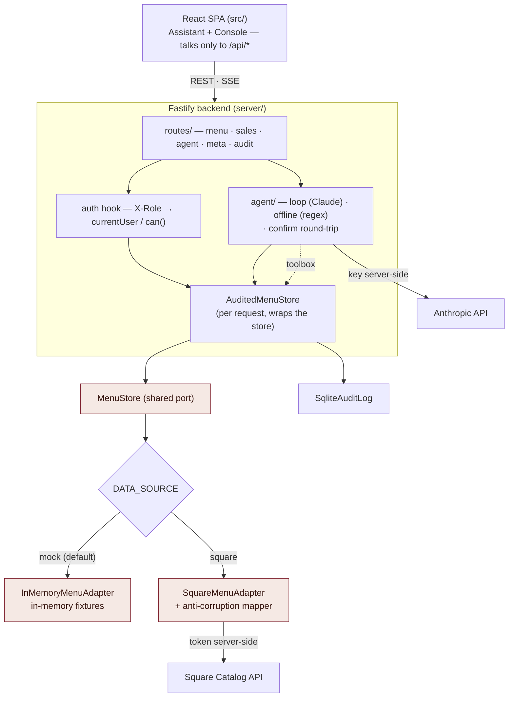
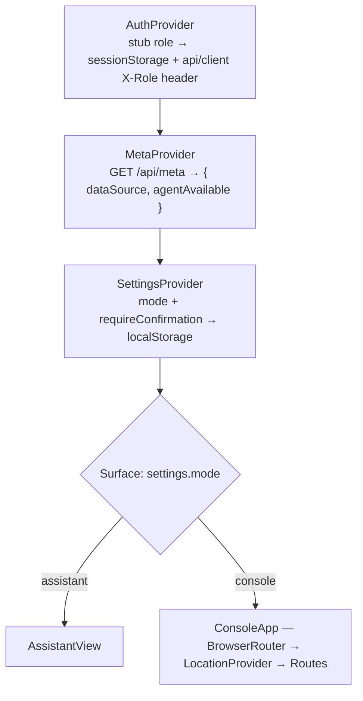
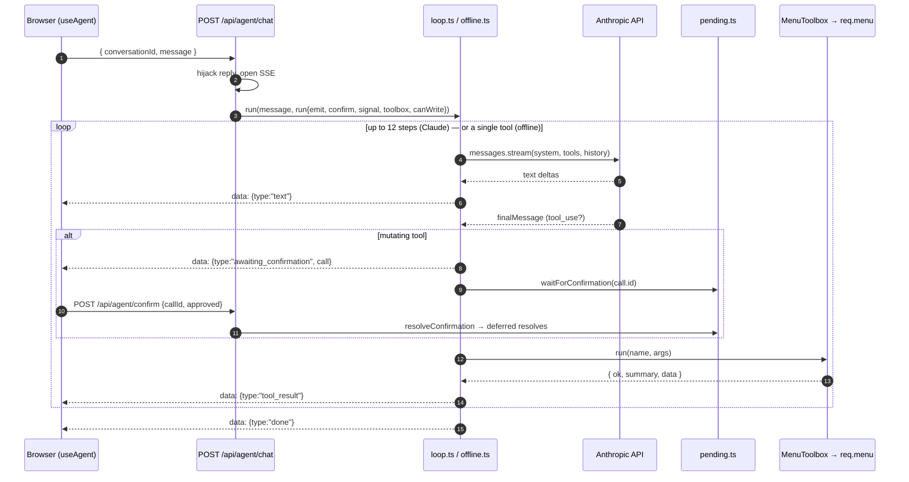
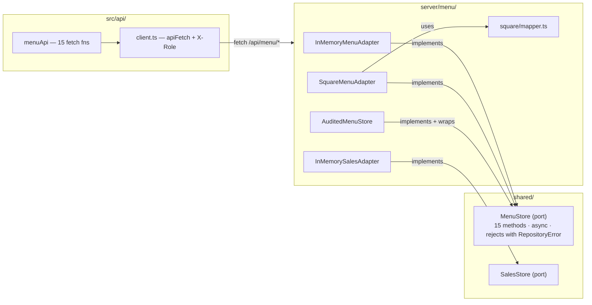
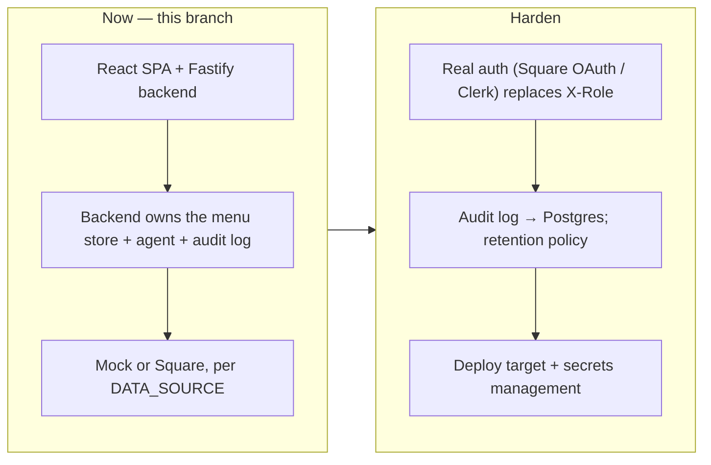

# Architecture

_Cà phê Việt menu admin — the whole app, as built. Companion docs: `DOMAIN.md`
(domain model), `PLAN.md` (phasing & decisions), `README.md` (setup)._

---

## 1. What this is

A menu-management app for a US-based, Vietnamese-branded coffee business whose
catalog of record is **Square**. It has two parts:

- a **Fastify backend** (`server/`) that owns everything: the Square
  integration, the anti-corruption mapper, validation, permission checks, the
  LLM agent loop, and an append-only audit log. It holds the two secrets (the
  Square token, the Anthropic key) and never leaks them.
- a **React SPA** (`src/`) that talks to nothing but `/api/*`. It has two
  interchangeable surfaces behind one toggle:

| Surface | What it is | Shell |
|---|---|---|
| **Assistant** (default) | Agent-first chat. You describe menu changes in plain language; the backend runs an LLM tool-loop (or a small offline parser when no key is set) and streams the result. Every mutation is gated by a human **Apply / Skip** card. | `features/assistant/AssistantView` — mobile |
| **Console** | Conventional admin console: React-Router screens for Items, Categories, Modifier groups, Pricing, and navigable reporting scaffolds. | `layout/AppShell` — sidebar |

Both surfaces reach the same backend endpoints. The frontend calls `/api/menu/*`
through a flat typed module (`menuApi`, `src/api/menu.ts`) — one `fetch` per
function, no logic. Server-side, those endpoints are backed by the **`MenuStore`**
port (`shared/MenuStore.ts`), implemented by either the in-memory or the Square
adapter; swapping the two is a server-side env flag, not a code change.

Everything is stateless with respect to the menu (Square is the source of
truth); the one piece of persistence is the SQLite **audit log**, written
behind an `AuditLog` interface so it can become Postgres later.

---

## 2. Technology

| Concern | Choice |
|---|---|
| Frontend | React 19 + TypeScript 6, Vite 8, React Router 7 (Console only), Tailwind v4 + hand-CSS for the chat surface |
| Backend | Fastify 5 on Node 24, run in dev by `tsx watch` |
| LLM | `@anthropic-ai/sdk` — **server-side only** (streaming, tool use) |
| Audit log | `better-sqlite3` behind an `AuditLog` interface |
| Shared | `shared/` — the domain model, the `MenuStore` / `SalesStore` interfaces, the wire contract, the error types; imported by both sides via the `shared/*` path alias |
| Lint | oxlint · **no test framework yet** |

Runtime deps: `react`, `react-dom`, `react-router-dom` (client); `fastify`,
`better-sqlite3`, `@anthropic-ai/sdk` (server).

---

## 3. System overview



The browser holds no secrets and makes no third-party calls. The backend is the
only trust boundary.

---

## 4. Runtime composition (frontend)

`main.tsx` mounts `<App/>`. `App.tsx` is a provider tree plus a surface switch:



There is no repository provider or DI: screens import `menuApi` (`src/api/menu.ts`)
directly. `src/api/client.ts` is the single fetch wrapper: it attaches the current
`X-Role` header and rebuilds a `{ error: { code, message } }` response into the typed
`RepositoryError` family, so component `catch` blocks can branch on
`ValidationError` / `PermissionError` / `NotFoundError` directly.

---

## 5. The Assistant surface

### 5.1 Client

`ChatView` renders the transcript (user / assistant text, tool-activity rows,
the `ConfirmCard`) and the composer. `useAgent()` is a **thin SSE client**:

- generates a `conversationId` (kept for the session)
- `send(text)` → `POST /api/agent/chat` (SSE); parses the event stream and folds
  each `AgentEvent` into the transcript with the same `handleEvent` switch the
  in-browser agent used
- on `awaiting_confirmation` → shows the `ConfirmCard`; **Apply/Skip** →
  `POST /api/agent/confirm { callId, approved }`
- **Stop** → aborts the fetch + `POST /api/agent/abort`
- when "Confirm every change" is off, `send` passes `autoConfirm: true` and the
  server skips the round-trip

### 5.2 The server loop



- **Permission**: a mutating tool checks `run.canWrite` (`req.can("menu.write")`)
  server-side. Staff get a `tool_result` error, no card.
- **History**: in-memory per `conversationId` (`conversations.ts`, bounded).
  Restart resets conversations — same as before.
- **Cleanup**: the response closing (Stop, navigation, network) aborts the
  Anthropic stream and denies all pending deferreds; a per-call 5-minute timeout
  auto-denies so a never-answered card can't wedge the turn.

### 5.3 Tool surface (`server/agent/menuTools.ts`)

12 tools, each mapping to one or a few `MenuStore` calls, plus the fuzzy
resolution the model relies on (`resolveItem` by id → exact name → unique
substring; `resolveCategoryId`; `pickVariation`; `money()`). `MenuToolbox` only
ever touches a `MenuStore`, which at runtime is `req.menu` (the audited wrapper).

---

## 6. The Console surface

Route-based (`src/routes/`), rendered inside `AppShell` (capability-filtered
sidebar, role switcher, data-source badge, the mode toggle). Screens call
`useAsync(() => menuApi.<method>(), [deps])` — a ~40-line hook
(`{ data, loading, error, reload }`) — and `reload()` after a mutation. They
also subscribe to `useMenuRevision()` so a change made in chat shows up in
the Console list without a manual refresh (§7.4).

Every Console chrome string goes through `t()` (`src/i18n/copy.ts`) — a single
English dictionary today; a Vietnamese translation is a second dictionary plus a
language switch, with no component changes. Menu content (item names like
"Cà phê sữa đá") is data, never routed through `t()`.

| Path | Purpose |
|---|---|
| `/items` · `/items/new` · `/items/:id` | list / create / detail (name, description, category, image, variations, modifier groups, archive) |
| `/categories` | list · create · rename |
| `/modifier-groups` | read-only table |
| `/pricing` | one row per variation, inline price edit (admin) |
| `/activity` | the audit log — `GET /api/audit`; every mutation (console or agent) with when / who / summary, and an expandable before → after (§7.6) |
| `/reporting` · `/analytics` · `/orders` | navigable "no data yet" scaffolds |

---

## 7. Shared core (`shared/`)

### 7.1 Domain model (`shared/domain/`)

A faithful, ergonomic projection of Square's Catalog — **never richer than
Square**. Full detail in `DOMAIN.md`. Shapes: `Money` (integer minor units),
`Item` (`… imageUrl?`), `Variation` (the priced unit), `ModifierGroup`,
`Category`, `Location`, `Role`. Helpers: `formatMoney`, `parseMoney`,
`effectivePrice`, and the stub auth model (`can(role, capability)`,
`userForRole`, `roleFromHeader`).

### 7.2 The menu store (`MenuStore`)



The **port** is `MenuStore` (`shared/MenuStore.ts`): 15 async methods returning
domain objects, rejecting with `RepositoryError`. Server-side it has two
**adapters** and one **decorator**; the frontend does **not** implement it.

- **Client** — `menuApi` (`src/api/menu.ts`) is a flat object of 15 functions,
  one `fetch` to `/api/menu/*` each, no logic. `client.ts` (`apiFetch`) attaches
  `X-Role` and maps an error body back to `ValidationError` / `PermissionError` /
  `NotFoundError`. `menuApi`'s method shapes are checked against the port's input
  types, which it imports from `shared/MenuStore.ts`.
- **`InMemoryMenuAdapter`** (adapter) — in-memory arrays from `fixtures`
  (deep-cloned reads, session-only writes, 180 ms simulated latency). Picks up
  `fixtures.generated.json` if the Square export was run.
- **`SquareMenuAdapter`** (adapter) — retrieve → mutate tree → upsert whole ITEM
  (Square's optimistic-concurrency model); sets the auth header itself. Uses
  `square/mapper.ts` for all shape translation (§7.3).
- **`AuditedMenuStore`** (decorator) — built **per request** with
  `req.currentUser`; records who/what/before→after around each mutation, passes
  reads through. Wraps whichever adapter `factory.ts` chose, and is used by the
  REST routes *and* the agent toolbox, so both log identically.
- `factory.ts` picks the in-memory vs Square adapter from `DATA_SOURCE`
  (process singleton); `auth.ts` wraps it in `AuditedMenuStore` as `req.menu`.

### 7.3 Anti-corruption layer (`server/menu/square/mapper.ts`)

Quarantines every Square-ism — the `type` discriminator, nested `*_data`,
`version` numbers, temp `#name` ids, `categories[]` vs legacy `category_id`,
`modifier_list_info[].enabled`, `image_ids[]` → `CatalogImage` URL. Nothing
outside `server/menu/square/` imports it.

### 7.4 Cross-surface reactivity (`src/api/menuRevision.ts`)

A module-level counter read through `useSyncExternalStore`. `useAgent` bumps it
after a successful mutating tool; Console screens include `useMenuRevision()`
in their `useAsync` deps. The only shared *state* between the two surfaces;
everything else flows through the API.

### 7.5 Wire contract (`shared/api.ts`)

`Meta`, `ApiErrorBody`, `AuditEntry`, `ToolCall`, `ToolResult`, the `AgentEvent`
SSE union, and the `AgentChat/Confirm/Abort` request bodies. The one file both
ends import to stay in sync.

### 7.6 Audit log

`AuditedMenuStore` (§7.2) writes to an `AuditLog` — one implementation
today, `SqliteAuditLog` (`better-sqlite3`, one append-only table at
`SQLITE_PATH`, created on boot). Swapping to Postgres is a second impl of the
same interface. Each entry is `{ at, actorRole, actorId, action, entityType,
entityId, summary, before?, after? }`; `summary` is the human line
(`Cà phê sữa đá (M) $4.50 → $4.75`), `before`/`after` the raw snapshots.
`GET /api/audit?limit=` returns recent entries; the Console's **Activity** tab
(`routes/reports/ActivityPage`) renders them and re-fetches on
`useMenuRevision()` so a chat edit shows up immediately.

---

## 8. Configuration & secrets

`.env.local` is read **only by the backend** (`npm run dev:api` → `tsx
--env-file`). The frontend bundle contains no configuration — it calls `/api/*`
and reads `GET /api/meta` for the two facts it needs.

| Variable | Read by | Purpose |
|---|---|---|
| `API_PORT` | backend + `vite.config.ts` | port the backend listens on / Vite proxies to (default 3001) |
| `DATA_SOURCE` | backend | `mock` (default) or `square` |
| `SQUARE_ACCESS_TOKEN` | **backend only** | Square API auth — set by `SquareMenuAdapter` |
| `SQUARE_ENVIRONMENT` | backend, `scripts/` | `sandbox` \| `production` → Square host |
| `SQUARE_LOCATION_ID` | `scripts/` (optional) | pin one location |
| `ANTHROPIC_API_KEY` | **backend only** | agent LLM; empty → offline parser |
| `AGENT_MODEL` | backend | agent model id |
| `SQLITE_PATH` | backend | audit-log file (created on first run) |

**Dev flow:** `npm run dev` runs `dev:api` (`tsx watch`) + `dev:web` (Vite)
concurrently; Vite proxies `/api` → `http://localhost:$API_PORT`. There is no
secret-injecting proxy any more — the backend *is* the boundary.

**Production:** `npm run build` (client → `dist/`) + `npm run build:api`
(esbuild bundle → `server-dist/`); serve the static client and run the Node
process behind it. A deploy target and real auth (replacing the `X-Role` stub)
are follow-ups.

---

## 9. Auth & permissions

Stubbed, no real identity. The client's "View as" switcher sets a `Role`, sent
as the `X-Role` header on every request; the backend's `onRequest` hook takes
that as the actor and enforces `can(role, capability)`:

| Capability | admin | staff |
|---|---|---|
| `menu.write` · `pricing.read` · `pricing.write` | ✔ | — |

- **Console** hides nav items / edit controls and redirects unauthorised routes;
  the backend also returns 403.
- **Assistant**: mutating tools are rejected server-side for staff (a
  `tool_result` error, no confirmation card).

The capability model lives in `shared/domain/auth.ts` so both ends agree.

---

## 10. Current limitations / not yet built

| Area | State |
|---|---|
| Persistence of in-memory writes | none — restart the backend and it reverts to fixtures |
| Menu persistence | Square is the source of truth; the backend caches nothing |
| Reporting / analytics / orders | navigable scaffolds; no order data pulled |
| Modifier-group editing | read-only in the Console; the agent has no modifier-group tools at all |
| Item image uploads against Square | reading an existing image works; setting one only works against the in-memory store (Square needs a file upload, not a URL) |
| Audit log | append-only SQLite (surfaced read-only in the **Activity** tab); no retention policy, no Postgres impl yet |
| Auth | stubbed `X-Role` header; no real identity |
| Conversation history | in-memory, lost on backend restart |
| Tests | none |
| Deploy | `build` / `build:api` produce artifacts; no target wired |

---

## 11. Phase evolution



The `MenuStore` port, the domain model, both surfaces, and the agent tools stay
stable across phases — only the adapter behind the port, the audit-log backend,
and the auth internals change.

---

## 12. Directory map

```
shared/                          imported by both sides via the `shared/*` alias
  domain/                        menu model + stub auth (see DOMAIN.md)
  MenuStore.ts                   the port the server implements + client input types
  SalesStore.ts
  errors.ts                      RepositoryError family + ErrorCode + errorFromWire()
  api.ts                         REST + agent SSE wire contract

server/                          Fastify backend — run by `tsx watch` in dev
  index.ts                       bootstrap: content-type parser, auth, error handler, routes
  config.ts                      env (DATA_SOURCE + both secrets) — read once
  auth.ts                        X-Role onRequest hook → req.currentUser / can() / menu
  menu/
    factory.ts                   in-memory vs Square adapter from DATA_SOURCE
    AuditedMenuStore.ts          per-request decorator: logs every mutation
    memory/                      InMemoryMenuAdapter + InMemorySalesAdapter + fixtures
    square/                      SquareMenuAdapter + mapper.ts
  agent/
    menuTools.ts                 12 tool specs + MenuToolbox
    loop.ts                      Claude tool-use loop, streams AgentEvents
    offline.ts                   regex fallback (no ANTHROPIC_API_KEY)
    run.ts                       shared per-tool-call path (announce → confirm → execute)
    conversations.ts             in-memory history, bounded
    pending.ts                   confirm round-trip (deferred map)
  audit/
    AuditLog.ts                  interface { record, list }
    SqliteAuditLog.ts            better-sqlite3 impl; one append-only table
  routes/                        one Fastify router per area — menuRouter · salesRouter · agentRouter · metaRouter · auditRouter

src/                             React SPA — talks only to /api/*
  App.tsx                        provider tree + Assistant/Console switch
  api/
    client.ts                    fetch wrapper: X-Role header + typed errors
    menu.ts                      menuApi — one fetch fn per /api/menu/* endpoint
    menuRevision.ts              cross-surface "menu changed" counter
  meta/MetaContext.tsx           GET /api/meta once
  agent/useAgent.ts              SSE client for /api/agent/chat + confirm/abort
  auth/AuthContext.tsx           stub role → sessionStorage + api/client
  settings/SettingsContext.tsx   mode + requireConfirmation → localStorage
  location/LocationContext.tsx   current location (Console-only)
  i18n/copy.ts                   t() — the single English dictionary for Console chrome (§6)
  features/assistant/ · features/chat/   the mobile chat shell + transcript
  layout/AppShell.tsx            Console shell
  routes/                        Console pages: menu/ · pricing/ · reports/{ActivityPage, scaffolds} · NotFoundPage
  components/                    ModeToggle · ui.tsx · ItemThumbnail · PhinMark
  lib/                           useAsync · placeholderImage

scripts/export-square-catalog.mjs   one-time pull → server/menu/memory/fixtures.generated.json
vite.config.ts                      React + Tailwind + a single /api proxy
tsconfig.{app,server,node}.json     three projects; `shared/*` path alias in app + server
```
