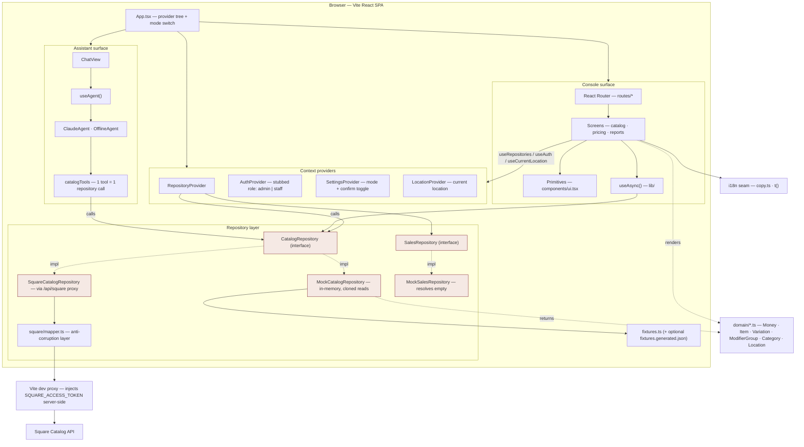
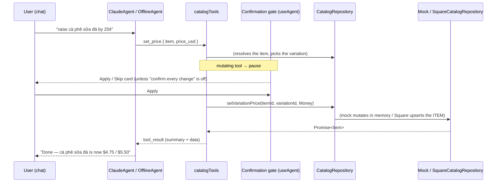
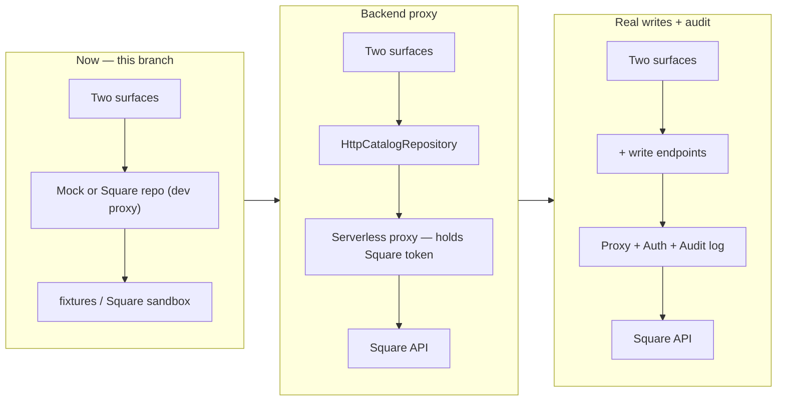

# Architecture

A local-only React SPA (Vite) with **two surfaces behind one toggle**:

- **Assistant** — agent-first chat. An LLM (Claude, or an offline command parser
  when no key is set) manages the menu through tools; every mutation is gated by
  a human **Apply / Skip** card.
- **Console** — the conventional admin console: React-Router screens for items,
  categories, modifier groups, pricing, and navigable report scaffolds.

Both surfaces talk to the **same repository interface**, never to data directly.
In development the implementation is either an in-memory mock (seeded from
fixtures) or a live `SquareCatalogRepository` that reaches Square through the
Vite dev proxy — chosen by `VITE_DATA_SOURCE`. Swapping in a real backend proxy
for production is one line in `RepositoryContext.tsx`; no component changes.

The agent adds **no backend of its own** — each of its tools is one
`CatalogRepository` call, the same operations the console performs.

## Layers

The highlighted boxes are the **swap seam** — the repository implementation and
its backing service change across phases; the domain model, the screens, the
agent tools, and the `CatalogRepository` interface stay stable.

## Request flow — "raise the price of cà phê sữa đá", via chat

The Console runs the same `setVariationPrice` call from `PricingPage`, gated by
`useAuth().can("pricing.write")` instead of the chat confirmation card.

## Phase evolution

Only the repository implementation and its backing service change. In the
conventional-first plan the agent was P4; here it is built early against the
mock/Square repository and hardens as the backend lands.

## Directory map

| Path | Role |
|---|---|
| `src/domain/` | Internal domain model — a faithful projection of Square's Catalog (see `DOMAIN.md`) |
| `src/config/env.ts` | Browser-visible config — data source, agent model. **No secrets.** |
| `src/repositories/*.ts` | Repository **interfaces** — the contract both surfaces depend on |
| `src/repositories/mock/` | In-memory implementations + fixtures (`fixtures.generated.json` optional, from the Square export) |
| `src/repositories/square/` | `SquareCatalogRepository` + `mapper.ts` anti-corruption layer |
| `src/repositories/RepositoryContext.tsx` | Picks mock vs Square from `VITE_DATA_SOURCE` (swap point for a real backend) |
| `src/repositories/catalogRevision.ts` | Bump counter so an agent edit can invalidate console reads |
| `src/agent/catalogTools.ts` | Tool specs + dispatch — each tool is one `CatalogRepository` call; mutating tools are flagged |
| `src/agent/ClaudeAgent.ts` | Anthropic tool-use loop; pauses on mutating tools for confirmation |
| `src/agent/OfflineAgent.ts` | No-key fallback — regex intents → the same toolbox |
| `src/agent/useAgent.ts` | React hook wiring the agent loop to the chat transcript + confirmation gate |
| `src/features/assistant/` · `src/features/chat/` | The mobile chat shell and its transcript / composer / confirmation cards |
| `src/settings/SettingsContext.tsx` | Persists the Assistant/Console mode and "confirm every change" |
| `src/components/ModeToggle.tsx` | The Assistant ⟷ Console switch, rendered in both shells |
| `src/auth/` | Stubbed `admin`/`staff` role + `can(capability)` |
| `src/location/` | Resolves the current location (multi-location model, no switcher UI yet) |
| `src/i18n/copy.ts` | `t()` seam — English only; Vietnamese later is one file |
| `src/layout/AppShell.tsx` | Console shell — sidebar nav (capability-filtered), role switcher, source badge, mode toggle |
| `src/routes/catalog/` | Items list / detail / create, categories, modifier groups |
| `src/routes/pricing/` | Variation price editing (admin only) |
| `src/routes/reports/` | Reporting / analytics / order history — navigable scaffolds |
| `src/lib/useAsync.ts` | Minimal async-data hook (no cache; add a query lib later if needed) |
| `src/index.css` | Design tokens (matched to the Phin POS kiosk) + the assistant surface's styles |
| `scripts/export-square-catalog.mjs` | One-time local script: pull real catalog + locations from Square → `fixtures.generated.json` |
| `vite.config.ts` | React + Tailwind plugins; the `/api/square` dev proxy that injects the token server-side |
